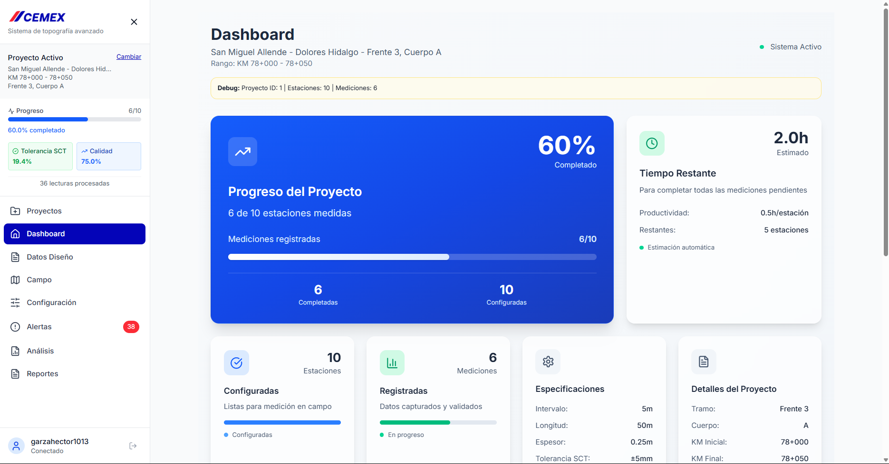
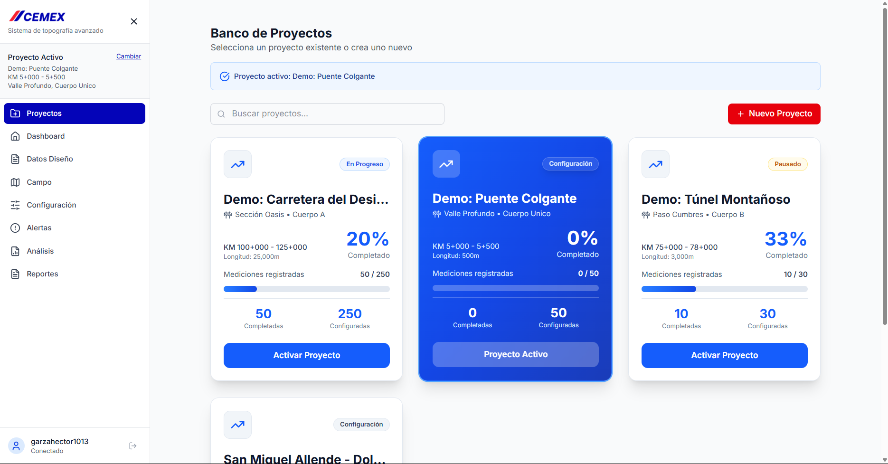
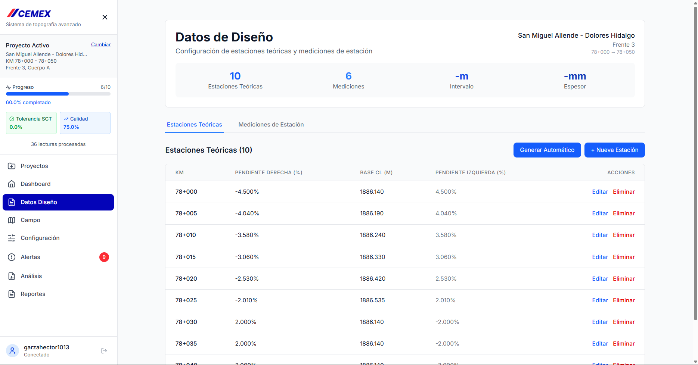
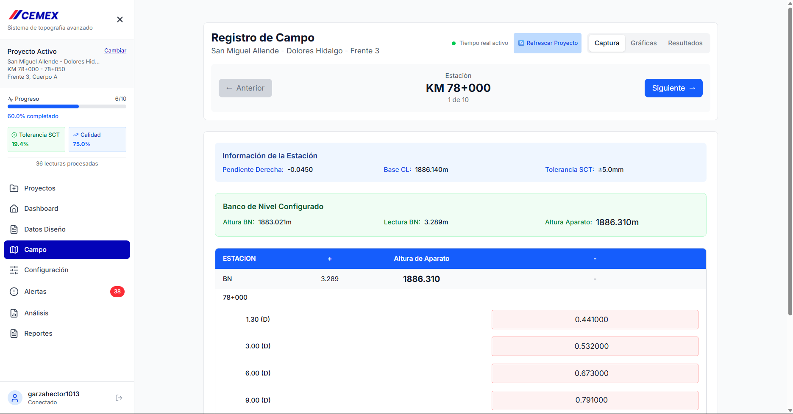
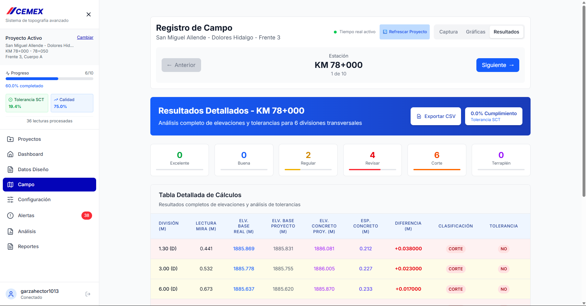
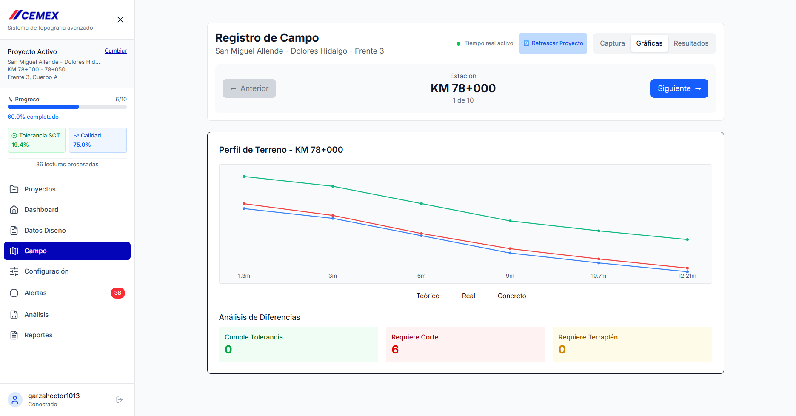
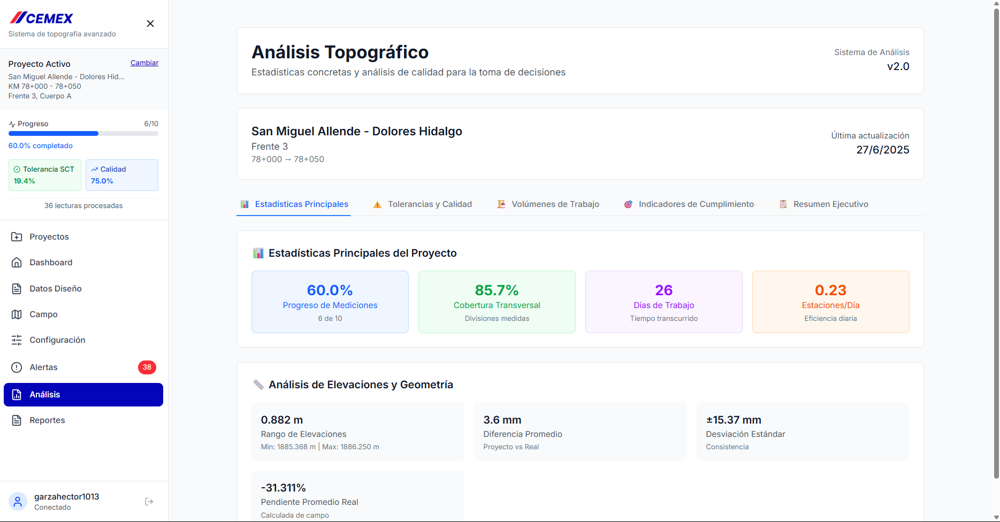

# 🏗️ Sistema de Topografía Profesional - CEMEX

> **Sistema completo de gestión topográfica para control de calidad en pavimentación de carreteras**

Una solución moderna y profesional desarrollada en colaboración con CEMEX para automatizar el control de calidad topográfico en proyectos de pavimentación, con cálculos automáticos basados en tolerancias SCT y análisis en tiempo real.

---

## ✨ **Características Principales**

### 🎯 **Gestión Completa de Proyectos**
- Configuración de proyectos con parámetros SCT
- Gestión de estaciones teóricas y divisiones transversales
- Control automático de intervalos y tolerancias

### 📊 **Captura de Datos en Campo**
- Interface optimizada para trabajo en campo
- Guardado automático con debounce inteligente
- Validación en tiempo real de mediciones
- Soporte offline y sincronización

### 🧮 **Cálculos Automáticos**
- **Elevación Base Real**: `altura_aparato - lectura_mira`
- **Elevación Base Proyecto**: Interpolación con pendientes
- **Elevación Concreto**: Cálculos de espesor
- **Clasificación SCT**: CUMPLE / CORTE / TERRAPLÉN
- **Control de Calidad**: EXCELENTE / BUENA / REGULAR / REVISAR

### 📈 **Análisis y Reportes**
- Dashboard con métricas en tiempo real
- Análisis estadístico de cumplimiento
- Gráficas de perfil de terreno
- Exportación a CSV/Excel
- Alertas automáticas de calidad

---

## 🖥️ **Capturas de Pantalla**

### 📋 **Dashboard Principal**
*Vista general del proyecto con métricas de progreso y alertas*



### 🏗️ **Gestión de Proyectos**
*Configuración y administración de proyectos topográficos*



### 📐 **Datos de Diseño**
*Configuración de estaciones teóricas y parámetros del proyecto*



### 📱 **Captura en Campo**
*Interface optimizada para registro de lecturas en campo*



### 📊 **Análisis de Resultados**
*Vista detallada con todos los cálculos y clasificaciones*



### 📈 **Gráficas de Perfil**
*Visualización del perfil de terreno vs proyecto*



### 📋 **Análisis Estadístico**
*Dashboard completo de análisis y cumplimiento*



---

## 🚀 **Tecnologías Utilizadas**

### **Frontend**
- **React 18** - Framework principal
- **Vite** - Build tool optimizado
- **Tailwind CSS** - Diseño responsive
- **React Query** - Gestión de estado servidor
- **React Router** - Navegación SPA

### **Backend**
- **FastAPI** - API REST moderna
- **SQLAlchemy** - ORM avanzado
- **PostgreSQL** - Base de datos robusta
- **Supabase** - Backend as a Service
- **Triggers SQL** - Cálculos automáticos

### **Funcionalidades Avanzadas**
- **Real-time sync** - Sincronización en tiempo real
- **Offline support** - Trabajo sin conexión
- **Auto-calculations** - Cálculos automáticos con triggers
- **Export capabilities** - Exportación profesional
- **Quality alerts** - Sistema de alertas inteligente

---

## 📦 **Instalación y Configuración**

### **Requisitos Previos**
```bash
- Node.js 18+
- Python 3.10+
- PostgreSQL 14+
- Cuenta Supabase
```

### **Frontend (React)**
```bash
cd topografia-frontend
npm install
npm run dev
```

### **Backend (FastAPI)**
```bash
cd topografia-backend
pip install -r requirements.txt
uvicorn main:app --reload
```

### **Base de Datos**
```sql
-- Ejecutar el esquema completo
psql -f esquema_completo.sql

-- Aplicar triggers automáticos
psql -f fix_estaciones_trigger.sql
```

---

## 🎯 **Flujo de Trabajo**

### **1. Configuración del Proyecto**
1. Crear proyecto con parámetros base
2. Definir estaciones teóricas
3. Configurar divisiones transversales

### **2. Trabajo de Campo**
1. Configurar banco de nivel por estación
2. Registrar lecturas en divisiones
3. Validación automática en tiempo real

### **3. Análisis y Control**
1. Revisión de cálculos automáticos
2. Análisis de cumplimiento SCT
3. Generación de reportes

### **4. Reportes Profesionales**
1. Exportación a formatos estándar
2. Gráficas de perfil profesionales
3. Alertas de calidad automatizadas

---

## 🔧 **Características Técnicas**

### **Cálculos Automáticos**
- ✅ Triggers SQL para recálculo automático
- ✅ Validación cruzada de datos
- ✅ Detección de errores sistemáticos
- ✅ Cumplimiento de tolerancias SCT

### **Control de Calidad**
- ✅ Clasificación automática por tolerancia
- ✅ Sistema de alertas por calidad
- ✅ Análisis estadístico en tiempo real
- ✅ Detección de puntos críticos

### **Optimización de Campo**
- ✅ Interface responsive para tablets
- ✅ Guardado automático con debounce
- ✅ Prevención de duplicados
- ✅ Sincronización en tiempo real

---

## 🤝 **Colaboración**

**Desarrollado en colaboración con:**
- **CEMEX** - Especificaciones técnicas y validación
- **Topógrafos profesionales** - Flujo de trabajo y UX
- **Ingenieros de calidad** - Algoritmos de validación

---

## 📄 **Licencia**

Este proyecto está desarrollado específicamente para CEMEX y uso profesional en topografía de carreteras.

